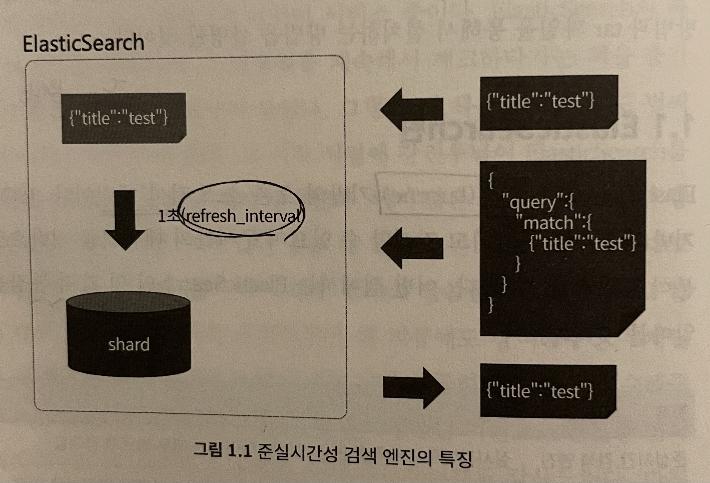
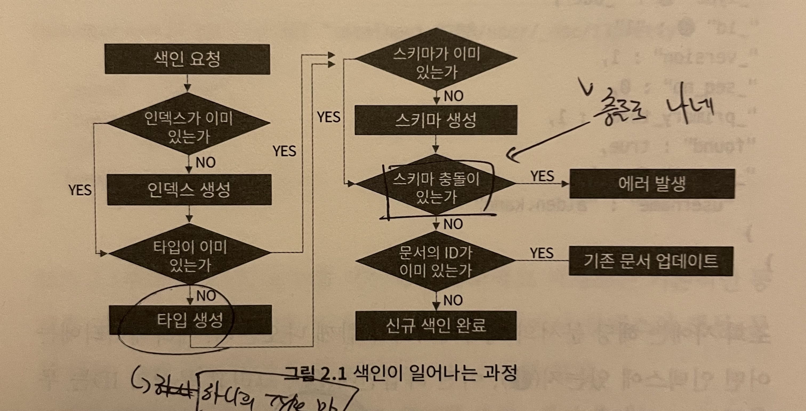

```
+++
author = "kmplex"
title = "기초부터 다지는 ES 운영노하우 1-2장"
date = "2022-03-27"
description = "Elastic Search 1-2장"
series = ["ES"]
categories = ["dev"]
+++
```

# ES 1장 훑어보기

Elasticsearch는 Lucence 기반의 오픈소스 검색엔진으로, Json 기반의 문서를 저장 / 검색 / 데아터 분석 작업을 할 수 있다.

ES는 아래 4가지 큰 특징을 갖고 있다.

- 준실시간 검색 엔진
- 클러스터 구성
- 스키마리스
- Rest API

`준실시간 검색 엔진` 이란, 실시간에 준하는 검색을 제공한다는 의미이다. ES는 데이터가 입력 될 경우 메모리에 우선 저장 후, Shard (데이터 저장공간)에 데이터를 저장한다.

> `refresh_interval` 에 입력된 주기로, 메모리에 저장된 데이터를 Disk에 옮긴다.  




`클러스터` 란, 여러대의 구성 요소를 논리적으로 결합하여, 하나의 구성 요소 처럼 사용 할 수 있게 해주는 기술이며, ES는 1개 이상의 노드를 묶어서 하나의 클러스터로 구성할 수 있다.
클러스터로 구성하면, 높은 수준의 안정성과 부하 분산을 기대할 수 있다. 또한 같은 클러스터에 속한 노드들은 메시 형태로 요청을 주고 받기때문에, 어떤 노드에서도 색인 / 검색 작업을 처리할 수 있다.

> 메시 ? 모든 구성 요소가 논리적으로 연결되어 있어, 다른 노드들과 직접적으로 통신할 수 있는 네트워크 형태를 의미한다.


`스키마리스` 란 문서를 입력하기 앞서, 어떤 필드를 저장 할 것인지 사전에 정의하지 않아도 된다는 의미이다. 

> 사전에 스키마를 정의하지 않아도, 데이터를 입력시 동적으로 스키마를 생성되며, 기존에 있는 컬럼에 다른 타입을 입력 할 경우 충돌이 발생한다.

`Rest API`를 지원함으로, 어떤 언어로도 Client 를 만들 수 있다.


# 2장 ES 기본 동작

## 문서 색인과 조회 

아래 요청은 인덱스를 생성하고, 문서를 색인하고, 스키마를 만드는 등, 많은 작업을 처리한다.

```text
# request 
PUT /user/_doc/1  
{
  "username" : "alden.kang"
}

# response
{
  "_index" : "user",
  "_id" : "1",
  "_version" : 1,
  "result" : "created",
  "_shards" : {
    "total" : 2,
    "successful" : 1,
    "failed" : 0
  },
  "_seq_no" : 0,
  "_primary_term" : 1
}
```

- PUT 은 새로운 문서를 입력한다. 
  - POST 는 수정
  - DELETE 는 삭제
  - GET은 조회를 의미한다.
- user 는 index 의 이름으로, 인덱스란 문서를 저장하는 가장 큰 논리적인 단위를 의미한다.
- _doc 은 문서의 타입을 의미하며, 6 버전 이후부턴 인덱스에 하나의 타입만 저장 할 수 있게 설계가 변경되었다.
- 1 은 문서의 ID 이며, 같은 ID 가 입력되면 문서를 수정한다고 인식한다.

즉, 위 요청은 user 라는 Index 에 _doc 타입으로 1번 문서를 색인해달라는 요청이다.   



1. 색인 요청 시, Index 가 없다면 Index 를 생성한다.
2. Index 생성 후 (or Index 가 있다면) 타입을 확인 후 생성한다.
3. 타입 이 후, scheme 가 없다면 생성하고, scheme 간 충돌이 있다면 exception 을 발생 시킨다.
4. scheme 에 문제가 없다면, 기존 문서 ID 값을 이용하여 생성 / 업데이트를 한다.

위 과정을 통해 Elasticsearch 는 Index / Type / Scheme 를 정의하지 않아도 문서를 색인 할 수 있다. 

저장된 문서를 확인하기 위해서 GET 을 사용한다.

```text
#request
GET /user/_doc/1

#response
{
  "_index" : "user", # 
  "_id" : "1",
  "_version" : 1,
  "_seq_no" : 0,
  "_primary_term" : 1,
  "found" : true,
  "_source" : {
    "username" : "alden.kang"
  }
}
```

조회 시에는 문서의 메티데이터가 함께 나오는데, 각 설명은 아래와 같다.

- "_index" 어떤 인덱스에 있는지를 의미한다.
- "_type" 어떤 타입인지를 의미한다.
- "_id" 문서의 id를 의미한다.
- "_source" 문서의 내용을 의미한다.

또한 문서를 삭제하기 위해선 DELETE 를 사용한다.

```text
#request
DELETE /user/_doc/1

#response
{
  "_index" : "user",
  "_id" : "1",
  "_version" : 2,
  "result" : "deleted",
  "_shards" : {
    "total" : 2,
    "successful" : 1,
    "failed" : 0
  },
  "_seq_no" : 1,
  "_primary_term" : 1
}
```

result 를 보면 정상적으로 삭제되었음을 알 수 있다. 문서를 삭제 후, 조회하면 아래와 같은 결과가 나온다.

```json
{
  "_index" : "user",
  "_id" : "1",
  "found" : false
}
```

이번엔 위 과정들을 조금 더 풀어서, 생성 / 색인 / 수정 등의 과정을 한 단계 씩 진행해 보자.

```text
# 문서 생성 
PUT /contents/_doc/1?pretty
{
  "title" : "How to use ElasticSearch",
  "author" : "alden.kang"
}
# response
{
  "_index" : "contents",
  "_id" : "1",
  "_version" : 1, 
  "result" : "created",
  "_shards" : {
    "total" : 2,
    "successful" : 1,
    "failed" : 0
  },
  "_seq_no" : 2,
  "_primary_term" : 1
}

# index 상태 확인 
GET _cat/indices?v

# response
health status index    uuid                   pri rep docs.count docs.deleted store.size pri.store.size
yellow open   contents n1yijQ6bQ8SpQSIuyLoDXg   1   1          1            0      4.6kb          4.6kb
yellow open   user     GuQ0DmjHQXa0AXWWCZpGSw   1   1          0            0      3.3kb          3.3kb
``` 

위 상태에서 문서의 내용을 바꾼 후, PUT을 입력하면 아래와 같은 응답을 받게된다.

```json
{
  "_index" : "contents",
  "_id" : "1",
  "_version" : 2,  # version 이 1 증가했다.
  "result" : "updated", # result 가 updated 로 바뀐다.
  "_shards" : {
    "total" : 2,
    "successful" : 1,
    "failed" : 0
  },
  "_seq_no" : 3,
  "_primary_term" : 1
}
```

위 처럼 동일한 ID 를 이용하여 문서를 입력하면, 수정이 발생한다.
또한 이렇게 입력된 scheme 정보는 아래 명령어로 확인 할 수 있다.

```text
# scheme mapping 정보 확인 
GET /contents/_mapping

#response 
{
  "contents" : {
    "mappings" : {
      "properties" : {
        "author" : {
          "type" : "text",
          "fields" : {
            "keyword" : {
              "type" : "keyword",
              "ignore_above" : 256
            }
          }
        },
        "title" : {
          "type" : "text",
          "fields" : {
            "keyword" : {
              "type" : "keyword",
              "ignore_above" : 256
            }
          }
        }
      }
    }
  }
}
```

위 응답으로, author, title 필드가 정의되었고 둘 다 문자열 형태의 타입으로 정의된 것을 알 수 있다.
이 상태에서 새로운 필드를 가진 문서를 색인하면, 아래처럼 scheme 이 바뀐다.

```text
PUT /contents/_doc/1?pretty
{
  "title" : "How to use ElasticSearch",
  "author" : "alden.kang",
  "rating" : 5.0
}

# response
{
  "contents" : {
    "mappings" : {
      "properties" : {
        "author" : {
          "type" : "text",
          "fields" : {
            "keyword" : {
              "type" : "keyword",
              "ignore_above" : 256
            }
          }
        },
        "rating" : { # rating 이 추가되었다.
          "type" : "float"
        },
        "title" : {
          "type" : "text",
          "fields" : {
            "keyword" : {
              "type" : "keyword",
              "ignore_above" : 256
            }
          }
        }
      }
    }
  }
}
```
정상적으로 문서가 색인 된 걸 볼 수 있는데, 기존에 scheme 가 정의되어 있다고 하더라도, 새로운 필드가 추가되면 동적으로 필드가 색인되고, 스키마가 정의된다는 것을 알 수 있다.

> rating 이 실수 형으로 입력되어, float type 으로 정의되었다.

만약 이미 저장된 scheme 과 다른 Type 으로 데이터가 입력되면 어떻게 될까 ?

```text

PUT /contents/_doc/3?pretty
{
  "title" : "How to use ElasticSearch",
  "author" : "alden.kang",
  "rating" : "Hello"
}

# response

{
  "error" : {
    "root_cause" : [
      {
        "type" : "mapper_parsing_exception",
        "reason" : "failed to parse field [rating] of type [float] in document with id '3'. Preview of field's value: 'Hello'"
      }
    ],
    "type" : "mapper_parsing_exception",
    "reason" : "failed to parse field [rating] of type [float] in document with id '3'. Preview of field's value: 'Hello'",
    "caused_by" : {
      "type" : "number_format_exception",
      "reason" : "For input string: \"Hello\""
    }
  },
  "status" : 400
}
```

위 처럼 타입이 맞지 않아, `mapper_parsing_exception` 이 발생한다.
scheme 충돌 에러는 로그 수집 시, 최초에 들어온 로그의 필드가 중간에 형태가 바뀌는 경우에 주로 발생한다.
그리고 이 에러가 발생하면, 해당 로그가 색인 되지 않기 때문에, 로그 유실이 발생 할 수 있다.

> ES 가 schemeless 라는 것은, 정의가 아예 없다는 뜻이 아니며, 동적 scheme 를 지원한다는 의미이다.
> 즉, 중간에 필드 형태가 바뀌는 것 까지 알아서 잡아주진 않는다.

## 문서 검색하기

자세한 옵션과 쿼리들은 9장에서 설명하며, 이번 장은 기능만 간단히 살펴본다.

첫번째로 모든 데이터를 검색하는 풀 스캔 쿼리를 날려보자.

```text
GET /kibana_sample_data_ecommerce/_search?q=*

#response
{
  "took" : 2,
  "timed_out" : false,
  "_shards" : {
    "total" : 1,
    "successful" : 1,
    "skipped" : 0,
    "failed" : 0
  },
  "hits" : {
    "total" : {
      "value" : 4675,
      "relation" : "eq"
    },
    "max_score" : 1.0,
    "hits" : [
      {
        "_index" : "kibana_sample_data_ecommerce",
        "_id" : "qxA0y38BuI-mHmqmzk_V",
        "_score" : 1.0,
        "_source" : {
          "category" : [
            "Men's Clothing"
          ],
    //생략
```

> kibana_sample_data_ecommerce 는 kibana 에서 추가한 sample data 를 의미한다.

q 는 query 의 약자이며, *은 모든 단어를 의미한다.
위 응답중 중요한 데이터는 아래와 같다.

- took 은 검색에 소요된 시간을 의미한다.
- _shards -> total 은 검색에 참여한 샤드의 개수를 의미한다.
- hits -> total 은 검색 결과의 개수를 의미한다.

검색 쿼리는 아래처럼 문자열을 검색하거나, 각 필드의 값을 검색 할 수 있다.

```text
# 1
GET /kibana_sample_data_ecommerce/_search?q=Eddie # Eddie 라는 문자열이 포함된 문서를 찾기 위한 검색

# 2
GET /kibana_sample_data_ecommerce/_search # order_id 가 584677 인 문서를 찾기 위한 query 이다.
{
  "query" : {
    "match" : {
      "order_id" : 584677
    }
  }
}
```

`#1` 은 Eddie 라는 문자열이 포함된 문서를 찾기 위한 Query 이며, `#2` 는 order_id 가 584677 인 문서를 찾기 위한 query 이다.

```text
#3
GET /kibana_sample_data_ecommerce/_search
{
  "query": {
    "bool" : {
      "must": {"match_all": {}},
      "filter": {
          "range": {
            "products.price": {
              "gte": 100
            }
          }
        }
    }
  }
}
```

`#3` 은 범위를 기준으로 한 검색으로, price 가 100 이상인 문서를 검색한다.

> filter 와 query 의 자세한 차이점은 9장에서 살펴본다.

## 문서 분석하기 

이 전까진 특정 조건을 만족하는 문서를 검색했다면, 검색을 바탕으로 통계 데이터를 만들 수 있다.
이러한 분석 작업을 aggregation 이라고 부르며, 역시 search API 를 기반으로 진행된다.

```text
#4
GET /kibana_sample_data_ecommerce/_search
{
  "size": 0,
  "aggs" : {
    "group_by_state": {
       "terms": {
         "field": "customer_gender"
       } 
    }
  }
}

# response
{
  "took" : 23,
  "timed_out" : false,
  "_shards" : {
    "total" : 1,
    "successful" : 1,
    "skipped" : 0,
    "failed" : 0
  },
  "hits" : {
    "total" : {
      "value" : 4675,
      "relation" : "eq"
    },
    "max_score" : null,
    "hits" : [ ]
  },
  "aggregations" : {
    "group_by_state" : {
      "doc_count_error_upper_bound" : 0,
      "sum_other_doc_count" : 0,
      "buckets" : [
        {
          "key" : "FEMALE",
          "doc_count" : 2433
        },
        {
          "key" : "MALE",
          "doc_count" : 2242
        }
      ]
    }
  }
}
```

`#4` 은 aggregation query 로, 상품을 구매한 성별을 기준으로 통계 데이터를 추출한다.

> FEMALE 가 2,433 건, MALE 이 2,242 건임을 알 수 있다.

```text
#5
GET /kibana_sample_data_ecommerce/_search
{
  "size": 0,
  "aggs" : {
    "group_by_state": {
       "terms": {
         "field": "customer_gender"
       },
       "aggs" : {
         "average_product" : {
           "avg": {
             "field": "total_quantity"
           }
         }
       }
    }
  }
}

# response 
{
  "took" : 2,
  "timed_out" : false,
  "_shards" : {
    "total" : 1,
    "successful" : 1,
    "skipped" : 0,
    "failed" : 0
  },
  "hits" : {
    "total" : {
      "value" : 4675,
      "relation" : "eq"
    },
    "max_score" : null,
    "hits" : [ ]
  },
  "aggregations" : {
    "group_by_state" : {
      "doc_count_error_upper_bound" : 0,
      "sum_other_doc_count" : 0,
      "buckets" : [
        {
          "key" : "FEMALE",
          "doc_count" : 2433,
          "average_product" : {
            "value" : 2.1265926839293052
          }
        },
        {
          "key" : "MALE",
          "doc_count" : 2242,
          "average_product" : {
            "value" : 2.1931311329170384
          }
        }
      ]
    }
  }
}
```

`#5` 쿼리를 통해, 성별로 구매한 평균 product 개수를 알 수 있다. 
이러한 분석 작업은 경우에 따라, 많은 양의 힙 메모리를 필요로 할 수 있기 때문에, kibana 같은 시각화 툴을 사용할 경우 조심해야한다.

> 데이터 범위를 지나치게 크게 잡을 경우, ES 전체가 응답 불가에 빠질 수 있다.
