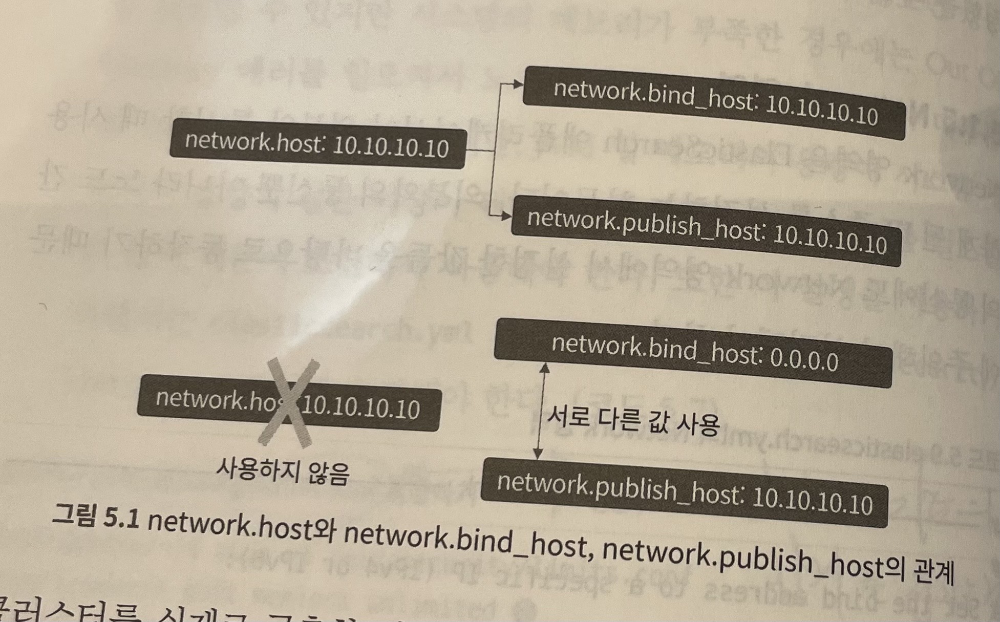
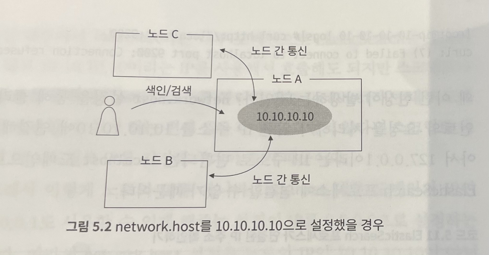

```
+++
author = "kmplex"
title = "기초부터 다지는 ES 운영노하우 5장 01"
date = "2022-04-02"
description = "Elastic Search 5장"
series = ["ES"]
categories = ["dev"]
+++
```

# 클러스터 구축하기

## elasticsearch.yml 설정 파일 

`elasticsearch.yml` 파을은 ES 구성하기 위해 기본이 되는 환경 설정 파일이다.
하나씩 살펴보자.    

[file](./elasticsearch.yml) 을 보면, 환경 설정을 영역별로 확인 할 수 있다.
대부분 주석처리 되어 있으며, 간략한 설명이 주석으로 제공된다.

`Cluster` 영역은 클러스터 전체에 적용되는 설정이다.

```text
# ---------------------------------- Cluster -----------------------------------
#
# Use a descriptive name for your cluster:
#
#cluster.name: my-application
```

cluster 이름을 설정하는 항목이다. 클러스터를 구성할 노드들이 모두 동일한 클러스터 이름을 사용해야한다. 
이름을 변경하려면, 클러스터 내의 모든 노드를 재시작해야하기 때문에, 처음부터 신중하게 설정해야한다.

> 주석처리 상태로, 프로세스를 시작하면, elasticsearch 라는 이름으로 자동 설정된다.

`Node` 영역은 해당 노드에만 적용되는 설정이다.

```text
# ------------------------------------ Node ------------------------------------
#
# Use a descriptive name for the node:
#
#node.name: node-1
#
# Add custom attributes to the node:
#
#node.attr.rack: r1
```

`node.name` 은 노드의 이름을 설정하는 항목으로, 클러스터 내에서 유일해야한다. ES는 ${HOSTNAME} 이라는 노드의 호스트명을 인식할 수 있는 변수명을 정의해놨기 때문에, 아래처럼 설정하면 이름 충돌을 방지할 수 있다.

`node.name: ${HOSTNAME}`

주석처러시, ES 가 랜덤한 문자열을 만들어 자동으로 설정한다.
마찬가지로 이름을 변경하려면 해당 노드를 재시작해야한다. 

`node.attr.rack`은 각 노드에 설정할 수 있는 커스텀 항목으로, 사용자 정의된 rack 값을 통해 HA 구성과 같이 샤드를 분배할 수 있는 기능이다.

`HA (High Availability)` 긴 시간동안 지속적으로 운영이 가능한 시스템 / 컴포넌트를 가르킨다.
Elasticsearch는 해당 값을 가지고 primary shard와 replica shard를 서로 다른 rack에 분배해주기 때문에 장애 상황시 복구가 유리하다.

> HA 구성을 지원한다. 

`Path` 영역은 데이터와 로그의 저장 위치와 관련된 설정이다.

```text
# ----------------------------------- Paths ------------------------------------
#
# Path to directory where to store the data (separate multiple locations by comma):
#
#path.data: /path/to/data
#
# Path to log files:
#
#path.logs: /path/to/logs
```

`path.data` 는 노드가 가지고 있을 문서들을 저장할 경로를 의미한다. 
색인된 문서들은 세그먼트에 파일로 저장되는데, 이 파일들이 위치하게 될 경로이다.

위 설정은 2개 이상의 경로로 지정될 수 있는데, 여러개의 디스크를 가지고 있는 노드에서 분산저장을 위해 사용할 수 있다.

`path.data: /path/to/data, /path/to/data2`

다만 관리가 복잡해지고, 두 개의 경로 중 하나에 문제가 생겼을 때, 정확히 어떤 문서들이 영향을 받게 되는지 알기가 힘들다는 문제점이 있다.


`path.logs` ES 에서 발생하는 로그를 저장할 경로이다.

`Memotry` 영역은 Elasticsearch 프로세스에 할당되는 메모리 영역을 어떻게 관리할 것인지 간략하게 설정 할 수 있다.

```text
# ----------------------------------- Memory -----------------------------------
#
# Lock the memory on startup:
#
#bootstrap.memory_lock: true
#
# Make sure that the heap size is set to about half the memory available
# on the system and that the owner of the process is allowed to use this
# limit.
#
# Elasticsearch performs poorly when the system is swapping the memory.
#
```

`bootstrap.memory_lock: true` 은 시스템의 스왑 메모리 영역을 사용하지 않도록 하는 설정이다.
ES 는 스왑 메모리 영역을 최대한 사용하지 않도록 권고하고 있는데, 스왑 메모리를 사용하지 않으면 성능을 보장 할 수 있지만, OOM 에러를 일으켜 노드의 장애로 이어질 수 있다.
JVM 힙 메모리의 용량이 시스템 메모리의 용량에 절반 이상이 된다면, OOM 을 발생시킬 수 있기때문에 주의해야한다.

> 스왑메모리? 메모리가 부족할 경우, 디스크의 일부분을 메모리처럼 쓰는 가상 메모리이다.
> 스왑메모리를 사용할 경우, (순수 메모리를 사용하는것에 비해) 처리 속도가 저하될 수 있다.

이 설정을 사용하기 위해서는 OS 의 `/etc/security/limits.conf` 도 수정해야한다.

```text
elasticsearch soft memlock unlimited # soft 는 실제 적용되는 값
elasticsearch hard memlock unlimited # soft 가 부족할때, hard 까지 값을 사용 할 수 있음
```

> limits.conf 파일은 로그인한 유저(혹은 유저그룹)에 대하여 할당되는 자원들의 한계를 정하는 파일이다.
> memlock 은 쉘에 허용 가능한 메모리 설정을 위한 type 이다.

`elasticsearch` 는 프로세스를 실행 시키는 계정 이름이다. 
또한 systemd 로 프로세스를 시작한다면 추가 설정이 필요할 수 있다.

즉, swap 영역을 사용하지 않으려면, elasticsearch 가 메모리 영역을 모두 사용 할 수 있게 설정해야한다.

`Network` 영역은 Elasticsearch Application 이 외부와 통신할때 사용하게 될 Ip 주소를 설정하는 항목이다.

외부와의 통신 뿐 아니라, `노드간의 통신` 에도 Network 영역에서 설정한 값들을 바타응로 동작하기 때문에 주의해서 설정해야한다.

```text
# ---------------------------------- Network -----------------------------------
#
# By default Elasticsearch is only accessible on localhost. Set a different
# address here to expose this node on the network:
#
#network.host: 192.168.0.1
#
# By default Elasticsearch listens for HTTP traffic on the first free port it
# finds starting at 9200. Set a specific HTTP port here:
#
#http.port: 9200
#
# For more information, consult the network module documentation.
```

`network.host` 은 application 이 사용하게 될 IP 주소를 설정한다. 다양한 Ip를 application 에 설정할 수 있는데, 로컬 IP(127.0.0.1) 를 설정할 수도 있고 공개 IP(서버에서 사용하고 있는 Ip)를 사용할 수 도 있다.    
만약 두가지 경우를 모두 사용하고자 한다면, 0.0.0.0 의 IP 주소를 사용할 수도 있다.



`network.host`는 `network.bind_host` 와 `network.publish_host` 로 구성된다.    
`network.host`을 사용하면, 내부적으로 두 값이 같은 값으로 설정되는 관계이다.

`network.bind_host` 은 client 요청을 처리하기위한 Ip 이며,
`network.publish_host`는 클러스터 내부의 노드간 통신 Ip 이다.

  

만약 `network.host`로 공통 IP를 설정 할 경우, 위처럼 노드간 통신을 할 수 있다.
다만, IP 를 통해 host를 설정 할 경우, localhost 라는 내부 도메인을 사용할 수 없다.

> IP가 10.10.10.10 으로 설정되어, 127.0.0.1 에 연결할 수 없기 때문이다.

위 같은 이유로, 보통 `network.host`를 0.0.0.0 으로 Ip 를 설정한다. 다만, 위 설정도 노드가 여러개가 되면 문제가 발생한다.
각자의 host 를 0.0.0.0 으로, 같은 IP로 통신하려고하니 당연히 통신이 불가능해진다.

[같은 Ip 로 설정했을 경우](./same-network-host.jpg)

따라서, client 요청을 처리하기 위한 설정인 `network.bind_host` 는 0.0.0.0 으로 설정해야하며,
클러스터 내부의 노드간 통신 Ip 인 `network.publish_host` 는 노드 자신의 Ip 로 설정해야한다.


`http.port` application 이 사용하게될 port 를 의미한다.

`Discovery` 영역은 노드간의 클러스터링을 위해 필요한 설정이다.

```text
# --------------------------------- Discovery ----------------------------------
#
# Pass an initial list of hosts to perform discovery when this node is started:
# The default list of hosts is ["127.0.0.1", "[::1]"]
#
#discovery.seed_hosts: ["host1", "host2"]
#
# Bootstrap the cluster using an initial set of master-eligible nodes:
#
#cluster.initial_master_nodes: ["node-1", "node-2"]
#
# For more information, consult the discovery and cluster formation module documentation.
```

`discovery.seed_hosts` 는 클러스터링을 위한 다른 노드들의 정보를 의미한다.

`cluster.initial_master_nodes` 마스터 노드 역할을 할 수 있는 노드를 의미한다.

Elasticsearch 는 Application 이 최초 구동될 때, Discovery 영역을 읽어서, 어떤 노드들과 클러스터링을 구축하게 되는지 정보를 확인한다.
Application 이 실행되면, `discovery.seed_hosts` 에 입력된 host 에 ES 가 동작중인지 확인한다. 그리고 서버로부터 현재 구축되어 있는 클러스터 정보를 받아온다.

만약 이미 다른 클러스터에 합류된 상태라면, 해당 클러스터에 대한 정보를 받아온다. 그 후, 마스터 노드의 정보를 확인 한 뒤 성공적으로 클러스터에 합류하게 된다.

실제 운영 환경에서는 마스터 후보(`cluster.initial_master_nodes`)를 1개만 설정하면 안되고, 3개 이상의 홀수개로 설정해야한다.

`split brain` 현상 


[split-brain](./split-brain.jpg)

마스터 후보를 1개 혹은 2개 이상의 짝수개로 운영할 경우, 네트워크 단절 발생 시, 각자가 서로 다른 cluster 로 분리될 여지가 있다.
이러한 이슈를 split-brain 현상이라고 말하고, 이를 해결하기 위해 3개 이상의 홀수개로 마스터 후보 노드를 선정해야한다.

>  네트워크가 복구 되면 서로 다른 클러스터가 합쳐지면서 무결성을 해치는 이슈가 발생 할 수 있다.

`(마스터 후보 노드 / 2) + 1` 로 마스터 후보 노드 수를 결정해야한다.

[split-brain 방지](./prevent-split-brain.jpg)

> 주의) ES 7 로 올라오면서 책에서 설명하는 설정들이 사라지고, 새로운 설명이 추가되었다.

ES 7 점대 부터는 `node.master: true` 설정이 추가되면서, 클러스터가 스스로 `minimum_master_nodes` 노드 값을 변경한다.
사용자는 최초 마스터 후보로 선출할 `cluster.initial_master_nodes: [ ]` 값만 설정하면 된다.

> 7점 이상부턴 사용자가 split brain 에 대해 걱정하지 않아도 된다.

`Gateway` 설정은 클러스터의 복구와 관련된 내용들을 포함한다.

`gateway.recover_after_nodes` 는 클러스터 내의 노드를 전부 재시작 할때, 최소 몇개의 노드가 정상적인 상태일때, 복구를 시작할 것인지 설정한다.

elasticsearch 의 버전 업을 하거나, 장애로 인해 클러스터 내의 모든 노드를 다시 시작해야하는 경우가 있다.

> 이러한 작업을 Full Cluster Restart 라고 부르며, 이렇게 재시작한 노드들은 순차적으로 다시 클러스터링을 진행한다.

클러스터링을 진행 하면서, `gateway.recover_after_nodes`에 설정된 수 만큼 노드가 복구되었을 때, Index 데이터에 대한 복구를 진행한다.
해당 설정은 다시 `data_nodes` 와 `master_nodes` 로 나뉘는데, 장애 발생 시 안정적으로 클러스터를 복구하는데 도움이 되기때문에 적정한 수치를 설정하는 것이 좋다.

`Various` 영역은 아래와 같다.

```text
# ---------------------------------- Various -----------------------------------
#
# Allow wildcard deletion of indices:
#
#action.destructive_requires_name: false
```

`action.destructive_requires_name` 은 클러스터에 저장되어있는 인덱스를 _all 이나 wildcard 표현식으로 삭제할 수 없도록 막는 설정이다. 

> 실수로 전체 인덱스를 삭제하지 못하게 하는 설정이다.


## 노드의 역할과 정의

앞서 Elasticsearch 는 각 노드의 역할을 정의하여 클러스터를 구성한다고 설명한 바 있다.
각각의 역할을 설정하기 위한 항목은 아래와 같다.

```text
node.master : true
node.data: true
node.ingest: true 
설정 없음 (coordinate node)
```

모든 역할의 기본 값은 true 이며, 아무런 설정을 하지 않은 노드는 마스터 / 데이터 / 인제스트 / 코디네이트 역할을 모두 할 수 있다.

> 역할을 사용하지 않으려면, false 로 설정해야한다.

만약 master 로만 사용하려면 아래처럼 설정하면 된다.

```text
node.master : true
node.data: false
node.ingest: false 
```

위와 같이 각 역할을 true / false 로 두면 노드가 한가지 역할만을 하게된다.
만약 코디네이트 노드를 설정하려면, 모두 false 로 설정하면 된다.

```text
node.master : false
node.data: false
node.ingest: false 
```

> 버전이 바뀌면서 `node.roles` 로 설정이 바뀌었다.


데이터 노드가 코디네이트 역할 / 데이터 역할을 모두 수행할 경우, 노드의 사용량이 높아지는데 이를 방지하기 위해 코디네이트 노드를 설정한다.

요청이 들어왔을 때, 검색한 결과를 저장할 데이터 큐와 결과를 취합하기 위한 코디네이트 큐가 필요하게 되는데, 이는 힙 메모리 사용량의 증가로 이어진다.    
이 영향으로 OOM 현상이 쉽게 일어 날 수 있어, 코디네이트 노드를 분리하는 것이 좋다.

> 특히 aggregate API 를 많이 사용한다면 더더욱 코디네이트 노드를 분리를 고려해야한다.


## jvm.options 설정 

ES 는 자바로 만들어진 application 이기에 heap 메모리, GC 방식등과 같은 JVM 관련 설정이 필요하다.
`jvm.options` 설정파일을 통해 설정을 바꿀 수 있다.

> 자세한 설정들은 여기에서 기술하지 않는다.

또한, ES 에서는 전체 메모리의 절반 정도를 Heap 메모리로 할당하도록 권고한다.
ES 에서 색인된 데이터를 `세그먼트` 라는 물리적인 파일로 저장하는데, 이때 I/O 가 발생하게된다.
I/O 작업이 빈번할 경우, 시스템의 성능이 저하되고,  OS 에서는 이러한 성능 저하를 막기 위해 `페이지 캐시 기법` 을 사용한다. 
다만, 페이지 캐시는 application 들이 사용하지 않는 미사용 메모리를 활용 하기때문에 application 이 사용하는 메모리를 줄이는 것이 좋다.

특히 I/O 작업이 빈번한 ES 에서는 작업이 모두 메모리에서 끝날 수 있도록 하는 것이 성능 확보에 도움이 된다.

> 이러한 이유로 물리 메모리의 절반 정도를 힙 메모리로 할당할 것을 권고한다.

> 페이지 캐시란 ?

페이지 캐시는 데이터를 RAM에 가지고 있다가, 데이터 접근이 발생하면 disk에서 I/O 처리를 하지 않고, 메모리 영역의 데이터를 반환하여 처리할 수 있도록 하는 컴포넌트다.
I/O 가 발생하지 않기때문에 성능상의 이점이 있다.

## 클러스터 사용하기

지금까지 배운 설정을 바탕으로 클러스터를 직접 구축해보자.

> 클러스터 노드에 장애가 발생해도 문제 없이 서비스를 제공 할 수 있는지 확인한다.


단일 노드로 운영 중인 ES 를 3대의 마스터 노드와 3대의 데이터 노드로 바꿔본다.

> 이하 부분은 docker-compose 로 다시 정리한다.


