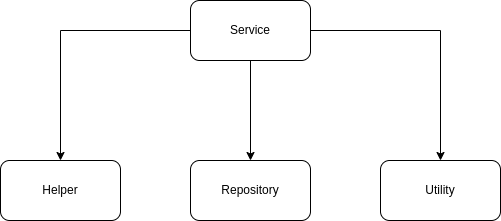
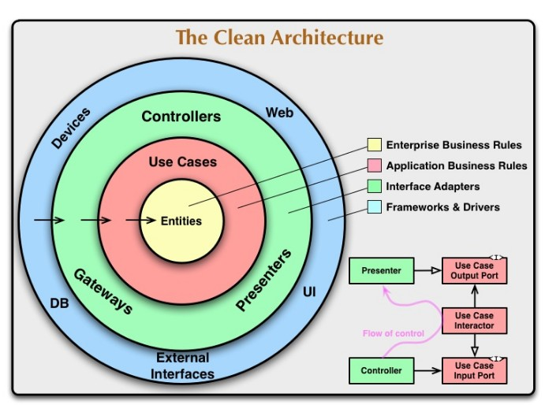
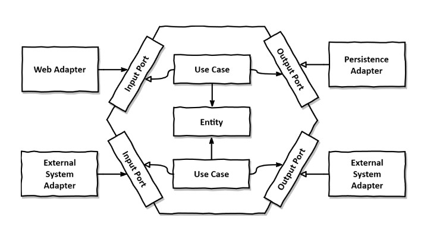

```
+++
author = "kmplex"
title = "만들면서 배우는 클린아키텍처 1일차"
date = "2022-10-23"
description = "만들면서 배우는 클린 아키텍처 1장 ~ 3장"
series = ["clean architecture"]
categories = ["study","ddd"]
+++
```

## 01. 계층형 아키텍처의 문제는 무엇일까 ?

상위 수준 관점에서 일반적인 3계층 아키텍처를 표현한 그림이다.


1) 웹 계층에서는 요청을 받아 도메인 혹은 비즈니스 계층에 있는 서비스로 요청을 보낸다.
2) 서비스에서는 필요한 비즈니스 로직을 수행하고, 도메인 엔티티의 현재 상태를 조회하거나 변경하기 위해 영속성 계층의 컴포넌트를 호출한다.

잘 만들어진 계층형 아키텍처는 선택의 폭을 넓히고 변화하는 요구사항과 외부 요인에 빠르게 적응 할 수 있게 해준다.
또한 계층을 잘 이해하고 구성한다면 웹 계층이나 영속성 계층에 독립적으로 도메인 로직을 작성 할 수 있다.

`그렇다면 무엇이 문제인가?`

#### 계층형 아케턱처는 데이터베이스 주도 설계를 유도한다.

전통적인 계층형 아키텍처의 토대는 데이터 베이스이다.
웹 계층은 도메인 계층에 의존하고, 도메인 계층은 영속성 계층에 의존하기에, 자연스레 데이터 베이스에 의존하게 된다.

모든 것이 영속성 계층을 토대로 만들어지는데, 이는 다양한 이유로 문제를 초래한다.

우리가 만드는 대부분의 애플리케이션의 목적은, 비즈니스를 관장하는 규칙 / 정책을 반영한 모델을 만들어서 사용자가 이러한 규칙과 정책을 더욱 편리하게 활용 할 수 있게 한다.    
즉, 비즈니스를 이끄는 것은 상태가 아닌 행동이다.

그렇다면 우리는 왜 데이터 베이스를 토대로 아키텍처를 만드는가 ?

> 그동안 만들어본 애플리케이션의 유스케이스를 떠올려보자. 아마 데이터베이스의 구조를 먼저 생각하고 이를 토대로 도메인 로직을 구현 했을 것이다.

이는 전통적인 계층형 아키텍처에서는 합리적인 방법이나, 비즈니스 관점에서는 전혀 맞지 않는 방법이다.
다른 무엇보다 도메인 로직을 먼저 만들고 이를 토대로 영속성 계층과 웹 계층을 만들어야한다.

데이터 베이스 중심적인 아키텍처가 만들어지는 가장 큰 원인은 ORM 프레임워크를 사용하기 때문이다.
ORM 프레임워크와 계층형 아키텍처를 결합하면, 비즈니스 규칙을 영속성 관점과 섞고 싶은 유횩을 쉽게 받는다.

하지만 이러한 설계는 영속성 계층과 도메인 계층 사이에 강한 결합이 생긴다.
서비스는 영속성 모델을 비즈니스 모델처럼 사용하게 되고, 이로 인해 도메인 로직뿐 아니라 영속성 계층과 관련된 작업들을 해야만한다.

`개인적인 생각`   
영속성을 기준으로 설계가 되는 이유는 DB call 혹은 transaction 을 짧게 가져가기 위함이라고 생각한다.
엄청 복잡한 스펙이 아닌 이상, api 의 응답속도는 DB의 읽기 지연 혹은 쓰기 지연으로 발생하는데, 자주 읽히는 데이터의 경우 행위 보다 상태를 우선시하여 설계 할 수도 있을거 같다.

물론 책의 내용도 반드시 도메인과 영속성 모델이 반드시 달라야한다. 라고 말하는건 아니다.

> 항상 그렇듯, 상황에 맞게.. 

#### 지름길을 택하기 쉬워진다.

전통적인 계층형 아키텍처에서 전체적으로 적용되는 규칙은, 특정 계층에서 같은 계층에 있는 컴포넌트나 아래에 있는 계층에만 접근 가능하다는 것이다.
개발 팀 내에서 합의한 다른 규칙들이 있을 수 있고, 그중 일부는 개발 도구를 이용해 강제화 했을지 모르지만, 계층형 아키텍처 자체는 위 규칙외 다른 규칙을 강제하진 않는다.

만약, 상위 계층에 위치한 컴포넌트에 접근해야한다면 간단하게 컴포넌트를 계층 아래로 내려버리면된다.

딱 한번 이렇게 하는건 괜찮지만, 마감이 다가오거나 전례가 있을 경우 점점 아키텍처가 이상해 질 수 있다. ~~깨진 창문 이론~~



결국 수년에 걸친 개발과 유지보수로 위 그림처럼 될 확률이 높다.
이러한 지름길 모드를 끄고 싶다면, 아키텍처 규칙을 강제해야한다.    
`강제`란 해당 규칙이 깨졌을 때, 빌드가 실패하도록 만드는 규칙이다.

#### 테스트하기 어려워진다.

계층형 아키텍처를 사용 할 때, 일반적으로 나타나는 변화는 계층을 건너 뛰는 것이다.
엔티티의 필드를 하나만 조작하면 되는 경우, 웹 계층에서 바로 영속성 계층에 접근하면, 도메인 계층을 건드릴 필요가 없지 않을까?

다시 말하자면, 처음 몇번은 괜찮다. 다만 이러한 일이 자주 일어난다면, 두가지 문제점이 생긴다.

1) 도메인 로직을 웹 계층에 구현해버린다.
2) 웹 계층 테스트에서 영속성 계층도 mocking 해야한다.

#### 유스케이스를 숨긴다.

개발자는 새로운 코드를 짜는 것보다, 기존 코드를 바꾸는데 더 많은 시간을 쓴다.
즉, 기능을 추가하거나 변경할 적절한 위츠를 찾는 일이 빈번하고 때문에 아키텍처는 코드를 빠르게 탐색하는데 도움이 돼야한다.

앞서 이야기 했듯, 계층형 아키텍처에서는 도메인 로직이 여러 계층에 걸쳐 흩어지기 쉽다.
유스케이스가 간단해서, 도메인 계층을 생략한다면 웹 계층에 존재 할 수 도 있고, 영속성 계층으로 컴포넌트를 내렸다면 영속성 계층에 도메인 코드가 존재할 수도 있다.

이럴 경우, 새로운 기능을 추가할 적당한 위치를 찾는 일은 어려워진다.

또한 특정 도메인 서비스가 비대해져, 여러개의 유스케이스를 담당하는 아주 넓은 서비스가 만들어지기도 한다.
넓은 서비스는 영속성 계층에 많은 의존성을 갖게 되고, 다시 웹 레이어의 많은 컴포넌트가 이 서비스에 의존하게 된다.

서비스를 테스트하기가 점점 어려워지며, 작업해야할 유스케이스를 책임지는 서비스도 찾기 어려워진다.

고도로 특화된 좁은 도메인 서비스가 유스케이스 하나씩만 담당하게 된다면, 작업들이 꽤나 수월해진다.

#### 동시 작업이 어려워진다.

`지연되는 소프트웨어 프로젝트에 인력을 더하는 것은 개발을 늦출 뿐이다. (맨먼스 미신)`

계층형 아키텍처는 이런 측면에서 그다지 도움이 되지 않는다.
3명의 개발자가 한가지 기능을 개발 할때, 계층 단위로 작업을 쪼개서 분배하기도 어려우며, 코드에 넓은 서비스가 있다면, 서로 다른 기능을 동시에 작업하기 더욱 어려워지며, 같은 서비스를 동시에 작업하는 상황이 발생하게된다.
이는 병햡 충돌로 추가 시간을 소모하게 된다.

#### 유지보수 가능한 소프트웨어를 만드는 데 어떻게 도움이 될까 ?

과거 계층형 아키텍처를 만들어봤다면 해당 단점외에 다른 단점들도 떠오를 것이다.
올바르게 구축하고, 몇가지 규칙들이 적용된 계층형 아키텍처는 개발하기 쉬우며 코드를 쉽게 변경 / 유지보수 할 수 있다.

그러나 앞서 설명했듯, 계층형 아키텍처는 많은 것들이 잘못된 방향으로 흘러가도록 용인한다.
엄격한 자기 훈련 없인 시간이 지날 수록 프로젝트의 유지보수성이 저하되는데, 계층형 아키텍처의 함정을 염두면서 더 유지보수 하기 쉬운 솔루션을 만들어야한다.

어떤 아키텍처 스타일을 사용하든 단점은 분명히 존재하며, 지속적인 자기 훈련을 통해 유지보수성을 높여나가야한다.

## 2장 의존성 역전하기

#### 단일 책임 원칙 

단일 책임 원칙의 실제 정의는 아래와 같다.

`컴포넌트를 변경하는 이유는 오직 하나뿐이어야 한다.`
 
안타깝게도 "변경할 이유"라는 것은 컴포넌트 간의 의존성을 통해 쉽게 전파된다.

```text
A -> B // A 가 B 를 의존
B -> C // B 가 C 를 의존
```

위 경우에 C 의 변경이 A 에게도 영향을 줄 수 있으며 (전이 의존성), 이러한 의존성이 많아질 경우 단일 책임 원칙을 위반하고 시간이 갈 수록 변경하기 더 어려워진다.

> 특정 컴포넌트의 변경이 의존하고 있는 클래스들에게 까지 전파되어, 변경의 이유가 하나가 아니게된다.

코드의 한 영역을 수정 했을 때, 다른 영역에서 부수효과가 생겨날 수 있다.

#### 의존성 역전의 원칙 

계층형 아키텍처에서 계층 간의 의존성은 항상 다음 계층인 아래 방향을 가르킨다.
기
`Controller -> Service / Domain -> Persistence`

위와 같은 의존성때문에 영속성 계층을 변경할 때마다 잠재적으로 도메인 계층도 변경해야한다.
하지만 도메인 코드는 애플리케이션에서 가장 중요한 코드이다.    
이러한 의존성을 어떻게 제거할 수 있을까?

DIP 가 이 답을 알려준다.

`코드 상의 어떤 의존성이든 그 방향을 바꿀 수 있다.`

Service / Domain package 에선 persistence 를 직접보는게 아닌 추상화된 interface 를 바라보고, 
persistence는 해당 interface 를 구현함으로, domain / persistence 간의 의존성을 느슨하게 가져 갈 수 있다.

> interface 는 바뀌지 않는다는 가정 / 세부 구현을 domain 단에서 신경쓰지 않음 

또한 이렇게 구성할 경우 entity(domain) / repository(persistence) 간의 package 순환 참조를 피할 수 있다.

#### 클린 아키텍처 

로버트 C. 마틴은 클린 아키텍처라는 책을 통해, 설계가 비즈니스 규칙의 테스트를 용이하게 하고, 비즈니스 규칙은 프레임워크, DB 그 밖의 외부 애플리케이션이나 인터페이스로부터 독립적일 수 있다고 이야기했다.
이는 도메인 코드가 바깥으로 향하는 어떤 의존성도 없어야함을 의미한다.

대신 의존성 역전 원칙의 도움으로 모든 의존성이 도메인 코드를 향하고 있다.



이 아키텍처의 가장 중요한 규칙은, 계층 간의 모든 의존성이 안쪽으로 향해야한다는 것이다.
이 아키텍처의 도메인 엔티티들은 단일 책임을 갖기 위해, 조금 더 세분화되어 있으며 이를 통해 `넓은 서비스 문제`를 피할 수 있다.

도메인 코드에서는 어떤 영속성 / UI 프레임워크가 사용되는지 알 수 없기 때문에, 특정 프레임워크에 특화된 코드를 가질 수 없으며, 비즈니스 규칙에 집중 할 수 있다.

> DDD 를 가장 순수한 형태로 적용해 볼 수도 있다.

다만 그에 대가로, 외부 계층과 철저하게 분리되어야하므로, 엔티티에 대한 모델을 각 계층에서 유지보수해야한다.
예를 들어, 도메인은 영속성 계층을 모르기 때문에 엔티티(JPA)를 참조할 수 없으며, 도메인 계층과 영속성 계층이 데이터를 주고 받을 때, 객체를 변환하여 사용해야한다.

다른 계층도 마찬가지로, 같은 모델에 대하여 Presentation / Domain / Entity 3개의 class 가 파생 될 수 있다.

이는 바람직한 것으로, 도메인 계층은 다른 계층으로 부터 의존성이 제거된다.

#### 육각형 아키텍처 



위 그림은 육각형 아키텍처가 어떤 모양인지 보여준다.

육각형 안에는 도메인 엔티티와 이와 상호작용하는 유스케이스가 있다.
육각형에서 외부로 향하는 의존성이 없기 때문에, 마틴이 제시한 의존성 규칙이 그대로 적용된다는 점을 주목하자.

위 아키텍처에서 코어를 호출하는 어댑터를 주도하는 어댑터(driving adapter)라 하고, 코어에 의해 호출되는 어댑터를 주도되는 어댑터 (driven adapter)라고 부른다.

> 안으로 들어오는 어댑터를 driving / 나가는 어댑터를 driven 이라 부른다.

driving adapter 는 포트가 코어에 있는 유스케이스에 의해 구현되고, 어댑터에 의해 호출되는 인터페이스로 구성되며, 
driven adapter 는 포트가 어댑터에 의해 구현되어 코어에서 호출되는 인터페이스로 구성된다.

> 이러한 개념으로 포트와 어댑터 아키텍처로도 알려져있다.

#### 유지보수가 가능 한소프트웨어를 만드는데 어떻게 도움이 될까 ?

클린 아키텍처 / 육각형 아키텍처 / 포트와 어댑터 중 무엇으로 불리든 의존성을 역전 시켜 도메인 코드가 바깥쪽 코드에 의존하지 않게 함으로 영속성 / UI 에 특화된 문제로부터 결합을 제거하고 변경할 이유의 수를 줄일 수 있다.

> 변경할 이유가 적을 수록 유지보수성은 더 좋아진다.

또한, 도메인 코드는 비즈니스 문제에 딱 맞도록 자유롭게 모델링 될 수 있고, 영속성 코드와 UI 코드도 상황에 맞게 자유롭게 작성될 수 있다.

## 3장 코드 구성하기 

#### 계층으로 구성하기

코드를 구조화하는 첫 번째 접근법은 계층을 이용하는 것으로, 아래와 같이 코드를 구성할 수 있다.

```text
--domain
  |--Account
  |--Activity
  |--AccountRepository
  |--AccountService
--persistence
  |--..
--web
  |--..
```

1장에서 이야기한 것처럼 여러 가지 이유로 간단한 구조의 계층은 가장 적합한 구조가 아닐 수 있다.
그래서 이번에는 의존성 역전 원칙을 적용해서 domain 패키지에 있는 도메인 코드만 의존성이 향하도록 설정했다.

그러나 적어도 세가지 이유로 이 패키지 구조는 최적의 구조가 아니다.

1) 애플리케이션의 기능 조각이나 특성을 구분 짓는 패키지 경계가 없다.
    - 추가적인 구조가 없다면, 서로 연관되지 않은 기능들끼리 예상하지 못한 부수효과를 일으키게 될 수도 있다.
2) 애플리케이션이 어떤 유스케이스들을 제공하는지 파악 할 수 없다.
3) 비슷하게, 패키지 구조를 통해서는 우리가 목표로 하는 아키텍처를 파악할 수 없다.
   
#### 기능으로 구성하기

계층으로 구성하기 방법의 몇가지 문제점을 해결해보자.

다음 접근법은 예제 코드를 기능으로 구성한 것이다.

```text
--account
|--Account
|--AccountController
|--AccountRepository
|--AccountRepositoryImpl
|--SendMoneyService
```

가장 본질적인 변경은 계좌와 관련된 모든 코드를 최상위의 account 패키지에 넣었다는 점이다.
각 기능을 묶은 그룹은 package-private 접근 수준을 이용해 패키지간의 경계를 강화할 수 있다.

또한 이제 `송금하기` 유스케이스를 구현한 코드는 클래스 명만으로도 찾을 수 있게 됐다. 

> 애플리케이션의 기능을 코드를 통해 볼 수 있게 만드는 것을 `소리치는 아키텍처` 라고 명명한 바 있다.

다만, 이러한 방식의 패키징은 계층에 의한 패키징 방식보다 아키텍처의 가시성을 떨어뜨린다.
어댑터를 나타내는 패키지 명이나, 포트등을 확인 할 수 없으며, 실수로 의존성의 방향을 설정할 수 도 있다.

그렇다면, 한눈에 파악하기 쉬운 아키텍처는 어떻게 만들 수 있을까?

#### 아키텍처적으로 표현력 있는 패키지 구조 

```text
--account
|--adapter
      |--in
      |--out
|--domain
|--application
   |--port
      |--in
      |--out
```

이 처럼 표현력 있는 패키지 구조는 아키텍처에 대한 적극적인 사고를 촉진시킨다.
많은 패키지가 생기고, 현재 작업 중인 코드를 어떤 패키지에 넣어야 할지 계속 생각해야하기 때문이다.

이러한 패키지 구조의 장점은 DDD 개념에 직접적으로 대응시킬 수 있다는 점이다.

account 같은 상위 레벨 패키지는 다른 바운디드 컨텍스트와 통신할 전용 진입점과 출구를 포함하는 바운디드 컨텍스트에 해당한다.
또한 domain 패키지 내에서는 DDD 가 제공하는 모든 도구를 이용해 우리가 원하는 어떤 도메인 모델이든 만들 수 있다.

> 완벽한 방법은 없다. 그러나 표현력 있는 패키지 구조는 적어도 코드와 아키텍처 간의 갭을 줄일 수 있게 해준다.

#### 의존성 주입의 역할

가장 본질은 2장에서 배웠듯, 애플리케이션 계층이 인커밍/아웃고잉 어댑터에 의존을 갖지 않는 것이다.
다만 의존성 주입 프레임워크를 사용하지 않으면, 아웃고잉 어댑터를 사용 할 때, 실제 구현 코드를 넣어주는 작업이 필요하다. 

> 도메인 코드에서 구현체가 의존 될 수 있다. 

이러한 의존성을 끊기 위해서는 모든 계층에 의존성을 가진 중립적인 컴포넌트를 하나 도입하는 방식을 사용할 수도 있다.
